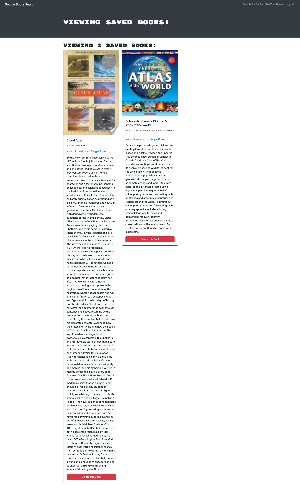

# Book-Search-MERN 

This project utilizes the Google Books API to create a GraphQL API with Apollo Server. It is built using the MERN stack and allows users to sign up and log in to their account. Users can search for books based on title, author, or keyword, and add their preferred books to a list of saved books. Additionally, users have the ability to remove books from their saved list.

## Tools Used

* JavaScript
* Node.js
* Express
* React
* Apollo Server
* Graphql
* Mongodb
* Mongoose
* Dotenv
* Heroku

## Usage

Instructions on how to use the project.

1. Create an account by signing up.
2. Log in with your account credentials.
3. Search for a book by title, author, or keyword.
4. Add a book to your saved books list.
5. Remove a book from your saved books list.

# Screenshots

# Table of Contents 
* [Summary](#Summary)
* [Tools Used](#Tools)
* [Snapshot](#Snapshot)
* [Installation & Database SetUp](#Installation)
* [Heroku](#Heroku)
* [License](#license)
* [Contributing](#contributing)
* [Tests](#tests)
* [Questions](#questions)

# Installation & Database SetUp
Step-by-step instructions on how to install and run the project.

1. Clone the repository: `git clone https://github.com/Bunix25/Book-Search-MERN`
2. Install dependencies: `npm install`
3. Start the development server: `npm start`
4. Open your browser and navigate to `http://localhost:3000`

# Heroku

(https://boks.herokuapp.com/)

# License

# Contributing
​Contributors: N/A

# Tests
N/A

# Questions?
## Please contact me:
  * [My GitHub Profile](https://github.com/Bunix25)
  * [My Github Project Repository](https://github.com/Bunix25)
  * Email us at: [svattt7@gmail.com](mailto:svattt7@gmail.com) with questions or make an issue about this project.